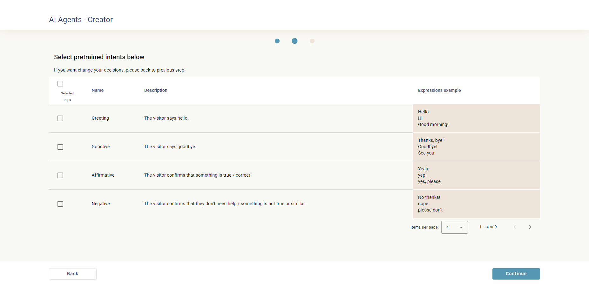
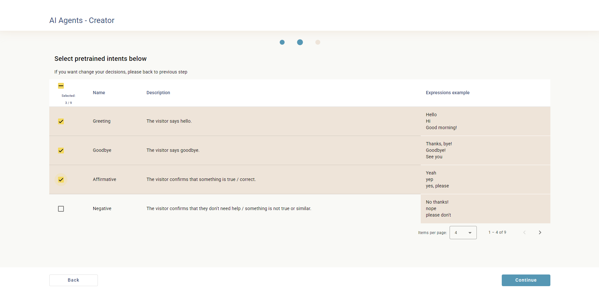
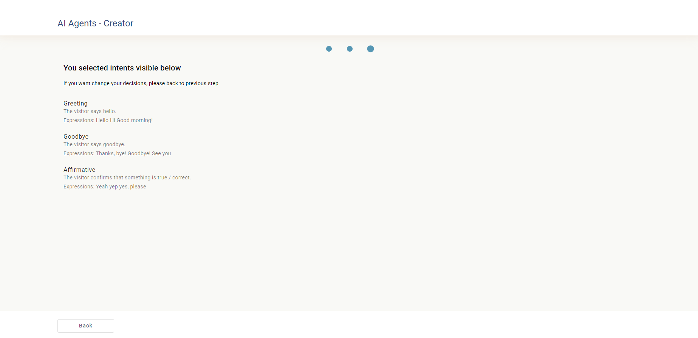
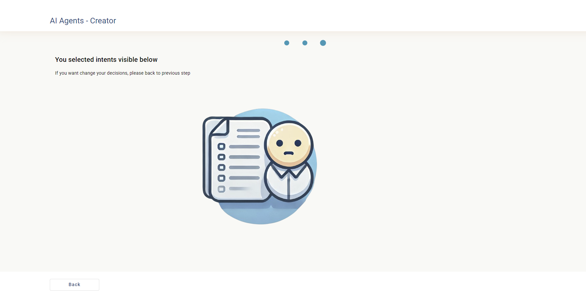

# ChaatbotWizard

This project was generated with [Angular CLI](https://github.com/angular/angular-cli) version 17.3.9.

## Development server
Run `npm i` to install whole needed dependencies
Run `ng serve` for a dev server. Navigate to `http://localhost:4200/`. The application will automatically reload if you change any of the source files.

## Running end-to-end tests

Run `npm run cypress:open` to execute the end-to-end tests via cypress

# Quick Overview

The application is the second step in the process of generating AI agents. This step is intended to present the details of the intents and the ability to choose the appropriate ones on a given topic

Ability to select all items from the list, individual items and deselect them
The list is paginated

Summary of selected intents

Simple validation via image when there is no data

